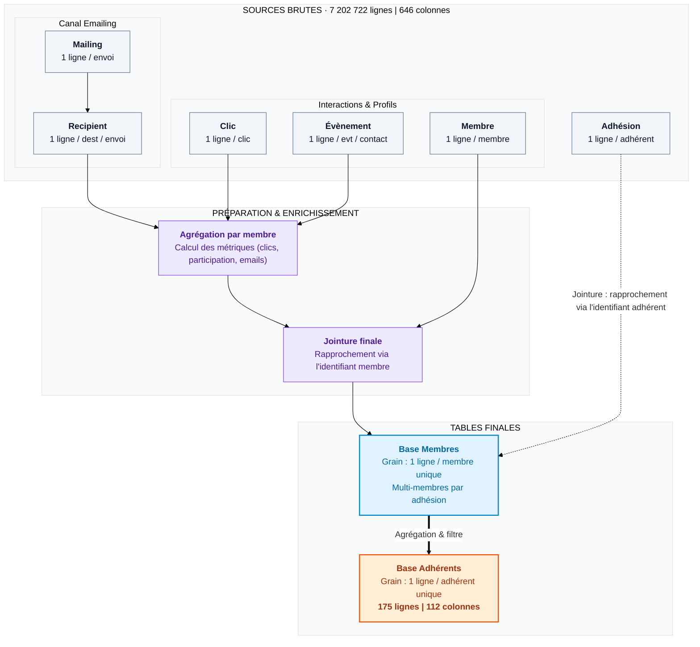

```mermaid
%%{init: {'theme': 'base', 'themeVariables': { 'primaryColor': '#e2e8f0', 'edgeLabelBackground':'#ffffff', 'tertiaryColor': '#f8fafc'}}}%%
flowchart TD

    %% --- COUCHE 1 : SOURCES ---
    subgraph SOURCES ["SOURCES BRUTES · 7 202 722 lignes | 646 colonnes"]
        direction TB
        
        subgraph G_MAIL ["Canal Emailing"]
            direction LR
            S_MAIL["<b>Mailing</b><br>1 ligne / envoi</small>"]
            S_DEST["<b>Recipient</b><br>1 ligne / dest / envoi</small>"]
            S_MAIL --> S_DEST
        end

        subgraph G_EVENTS ["Interactions & Profils"]
            direction LR
            S_CLIC["<b>Clic</b><br>1 ligne / clic</small>"]
            S_EVT["<b>Évènement</b><br>1 ligne / evt / contact</small>"]
            S_MBR["<b>Membre</b><br>1 ligne / membre</small>"]
        end

        S_ADH["<b>Adhésion </b><br>1 ligne / adhérent</small>"]
    end

    %% --- COUCHE 2 : PIPELINE ETL ---
    subgraph ETL ["PRÉPARATION & ENRICHISSEMENT"]
        AGG["<b>Agrégation par membre</b><br>Calcul des métriques (clics, participation, emails)</small>"]
        JOIN_MBR["<b>Jointure finale</b><br>Rapprochement via l'identifiant membre</small>"]
        AGG --> JOIN_MBR
    end

    %% Connexions Sources -> ETL
    S_DEST & S_CLIC & S_EVT --> AGG
    S_MBR --> JOIN_MBR

    %% --- COUCHE 3 : BASES CIBLES ---
      subgraph CIBLES ["TABLES FINALES"]
        direction LR
        
        T_MEMBRES["<b>Base Membres</b><br>Grain : 1 ligne / membre unique</small><br>Multi-membres par adhésion</small>"]
        
        T_ADHERENTS["<b>Base Adhérents</b><br>Grain : 1 ligne / adhérent unique</small><br><b>175 lignes | 112 colonnes</b></small>"]
    end

    %% Sorties finales
    JOIN_MBR --> T_MEMBRES
    S_ADH -.->|"Jointure : rapprochement via l'identifiant adhérent"| T_MEMBRES
    T_MEMBRES ==>|"Agrégation & filtre"| T_ADHERENTS

    %% --- STYLES ---
    classDef src fill:#f1f5f9,stroke:#64748b,stroke-width:1px,color:#0f172a;
    classDef etl fill:#ede9fe,stroke:#7c3aed,stroke-width:1px,color:#4c1d95;
    classDef cibleM fill:#e0f2fe,stroke:#0284c7,stroke-width:2px,color:#0369a1;
    classDef cibleA fill:#ffedd5,stroke:#ea580c,stroke-width:2px,color:#9a3412;

    class S_MAIL,S_DEST,S_CLIC,S_EVT,S_MBR,S_ADH src;
    class AGG,JOIN_MBR etl;
    class T_MEMBRES cibleM;
    class T_ADHERENTS cibleA;
```
